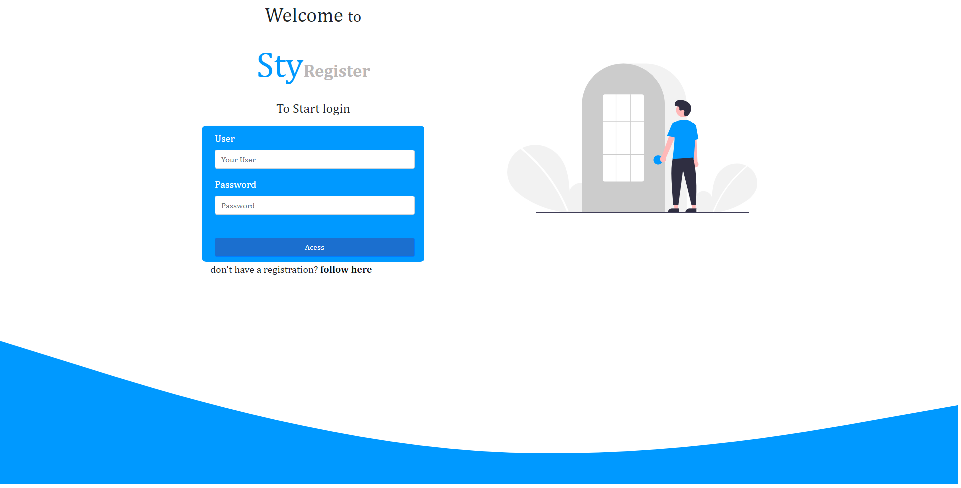
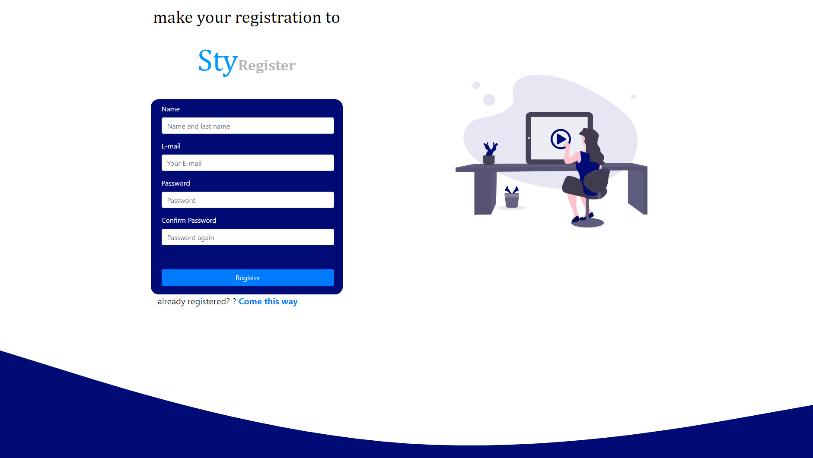

# Projeto-1
 Meu primeiro projeto com versionamento
 
 
 ## Projeto de cadastro e login de usuários
 
 ### Pagina de login:
 
  
 
 ### Pagina de cadastro:
 
 
 
 
 ### Tecnologias utilizadas: 
 
 - HTML5;
 
 - CSS3;
 
 - Javascript;
 
 - JSON;
 
 - XMLhttprequest;

### Descrição do projeto:

A criação de uma API REST para cadastrar um login e senha, e após o cadastro, realizar o login.

# Desenvolvido com carinho, por Ivan Vidal
